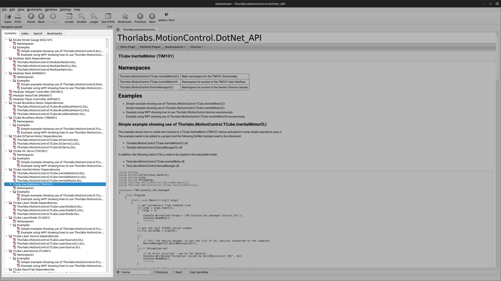
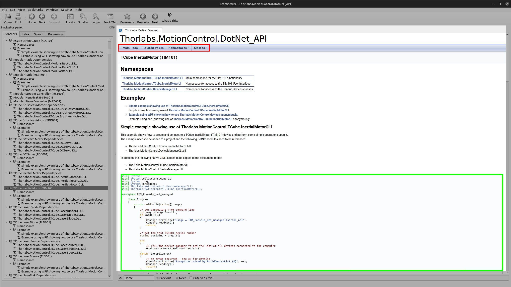

# Piezo
**Python interface for Thorlabs piezo devices**

Introduction
===============================================

This little library intends to map the Kinesis .NET API to python in order to control various Thorlabs piezos, motors etc ... The goal here is to bring the relevant Kinesis functions to practical high level classes. Each device has its own class, for instance a typical piezo actuated screw is controlled by a TCube controller, and corresponds to a Thorlabs TIM101 TCube Inertial Motor object.

Communication through Kinesis
==========================

Communication with the devices is achieved by using Kinesis DLL's through the Kinesis .NET API. This API is then accessed through a direct one to one mapping to python achieved thanks to pythonnet. The `clr` module of pythonnet allows to add the references of the objects we want to use as can be seen at the top of `piezo.py`. The references are added as follows :
```python
import clr
import sys

sys.path.append(r"C:\Program Files\Thorlabs\Kinesis")

# Add references so Python can see .Net
clr.AddReference("System")
clr.AddReference("Thorlabs.MotionControl.DeviceManagerCLI")
```
In the above example, we have added the `System` .NET namespace as well as the `Thorlabs.MotionControl.DeviceManagerCLI` namespace. The latter is the utility handling detection of the devices. After adding a reference, the namespace can be accessed as a regular Python class. One can then import all of its attributes and methods as follows :

```python
from System import String
from System import Decimal
import System.Collections
from System.Collections import *
# Generic device manager
from Thorlabs.MotionControl.DeviceManagerCLI import *
```

Once imported, all of the methods behave just like their .NET counterparts, but as Python objects. Function signatures are converted to the matching Python type by using the `System` types such as `String` or `Decimal`.

Adding devices
==============

Adding a new device to the library is a fairly straightforward operation. For this, one needs to take a look at the Kinesis .NET API (Thorlabs.MotionControl.DotNet_API.chm) documentation provided in the Kinesis folder. The first step is to find the Thorlabs model name of the device we wish to connect. This is easily done by opening the Kinesis app. Then, one needs to go in the documentation at the relevant chapter.

In the contents table on the [left pan](images/left_pane.png) of the compiled HTML viewer, you will find the list of all Thorlabs devices supported by the Kinesis API.



Let us look at the example of the TIM101. Opening the `TCube IntertialMotor` [tab](images/tim101.png), we can access the documentation of the whole class, with dependencies as well as subclasses and all related objects.  In **red**, the navigation tabs allow to access detailed documentation about all of the aforementioned objects.



Then, the shortest way to a working Python implementation is to simply copy the code example (in **green**) given on the device's main page. This code is very well commented and clear. As an example, here are a few lines with their translation in Python.

**.NET**
```java
{
    // Tell the device manager to get the list of all devices connected to the computer
    DeviceManagerCLI.BuildDeviceList();
}
catch (Exception ex)
{
    // an error occurred - see ex for details
    Console.WriteLine("Exception raised by BuildDeviceList {0}", ex);
    Console.ReadKey();
    return;
}
// get available TCube Inertial Motor and check our serial number is correct
List<string> serialNumbers = DeviceManagerCLI.GetDeviceList(TCubeInertialMotor.DevicePrefix);
if (!serialNumbers.Contains(serialNo))
{
    // the requested serial number is not a TSC001 or is not connected
    Console.WriteLine("{0} is not a valid serial number", serialNo);
    Console.ReadKey();
    return;
}

```

**Python**

```python
try:
  # Tell the device manager to get the list of all devices connected to the computer
  DeviceManagerCLI.BuildDeviceList()
except Exception:
  print(f"Exception raised by BuildDeviceList : {Exception}")
# get available TCube Inertial Motor and check our serial number is correct
serialNumbers = DeviceManagerCLI.GetDeviceList(TCubeInertialMotor.DevicePrefix)
if serialNo is not in serialNumbers:
  print(f"{serialNo} is not a valid serial number")
```

Then it is usually convenient to wrap this script in the following manner : the `__init__` method of each class should always buid the device list and do all of the error checking as to whether or not the device is available. Then it should initialize the configuration and settings of the device. For the TIM101 example, this gives the following example :

```python
class TIM101:
  def __init__(self, serial: str = None):
        """Instantiates a TIM101 object to control piezo mirror screws

        :param str serial: Piezo serial number
        :return: PiezoScrew object
        :rtype: PiezoScrew

        """
        # availability checks
        if serial is not None:
            DeviceManagerCLI.BuildDeviceList()
            device_list = DeviceManagerCLI.GetDeviceList(
                TCubeInertialMotor.DevicePrefix)
            if len(device_list) == 0 or serial not in device_list:
                print("Error : ")
            try:
                self.serial = serial  # SN of the Thorlabs Nano stage
                if len(device_list) == 0:
                    print("Error : No TCube motor found !")
                else:
                    if serial in device_list:
                        self.attempt_connection(serial)
                    else:
                        print("Error : Did not find the specified motor ")
                        for dev in device_list:
                            print(f"Device found, serial {dev}")
            except Exception:
                print("ERROR")
                print(traceback.format_exc())
        else:
            try:
                DeviceManagerCLI.BuildDeviceList()
                device_list = DeviceManagerCLI.GetDeviceList(TCubeInertialMotor.DevicePrefix)
                if len(device_list) == 0:
                    print("Error : No TCube motor found !")
                elif len(device_list) == 1:
                    print("Only one device found, attempting to connect to " +
                          f"device {device_list[0]}")
                    self.attempt_connection(device_list[0])
                else:
                    for counter, dev in enumerate(device_list):
                        print(f"Device found, serial {dev} ({counter})")
                    choice = input("Choice (number between 0 and" +
                                   f" {len(device_list)-1})? ")
                    choice = int(choice)
                    self.attempt_connection(device_list[choice])
            except Exception:
                print("ERROR")
                print(traceback.format_exc())
        # configuration initialization
        self.configuration = self.device.GetInertialMotorConfiguration(self.serial)
        self.settings = ThorlabsInertialMotorSettings.GetSettings(self.configuration)
        self.channel1 = InertialMotorStatus.MotorChannels.Channel1
        self.channel2 = InertialMotorStatus.MotorChannels.Channel2
        self.channel3 = InertialMotorStatus.MotorChannels.Channel3
        self.channel4 = InertialMotorStatus.MotorChannels.Channel4
        # set default settings StepRate and StepAcceleration
        self.settings.Drive.Channel(self.channel1).StepRate = 500
        self.settings.Drive.Channel(self.channel1).StepAcceleration = 100000
        self.settings.Drive.Channel(self.channel2).StepRate = 500
        self.settings.Drive.Channel(self.channel2).StepAcceleration = 100000
        self.settings.Drive.Channel(self.channel3).StepRate = 500
        self.settings.Drive.Channel(self.channel3).StepAcceleration = 100000
        self.settings.Drive.Channel(self.channel4).StepRate = 500
        self.settings.Drive.Channel(self.channel4).StepAcceleration = 100000
        self.device.SetSettings(self.settings, True, True)
        self.zero()
```

The connection in itself is handled by a separate method `attempt_connection` as the connection procedure differs from device to device. This allows to keep an almost identical `__init__` method for all devices. Also, keeping a separate `attempt_connection` method allows for easier debugging since it decouples logical bugs (mostly user error) from actual connectivity errors.

Finally, depending on the device, one can then wrap the relevant "move", "home" or "zero" methods (see the examples in [`piezo.py`](piezo.py))


Dependencies
============
* Pythonnet : Mapping of the .NET functions to Python. **WARNING** Pythonnet provides the `clr` module. If you attempt to `pip install` it you will end up with the `color` module which will be nice, but not what is needed here.
* For Unix systems : `mono` which is the open implementation of .NET. It can be installed directly through apt : `sudo apt install mono-complete`
* Numpy
* Kinesis : This code directly uses Kinesis DLL's. It can be run under all OS provided the path to the Kinsesis folder is added at the begining of `piezo.py` (l.24)
